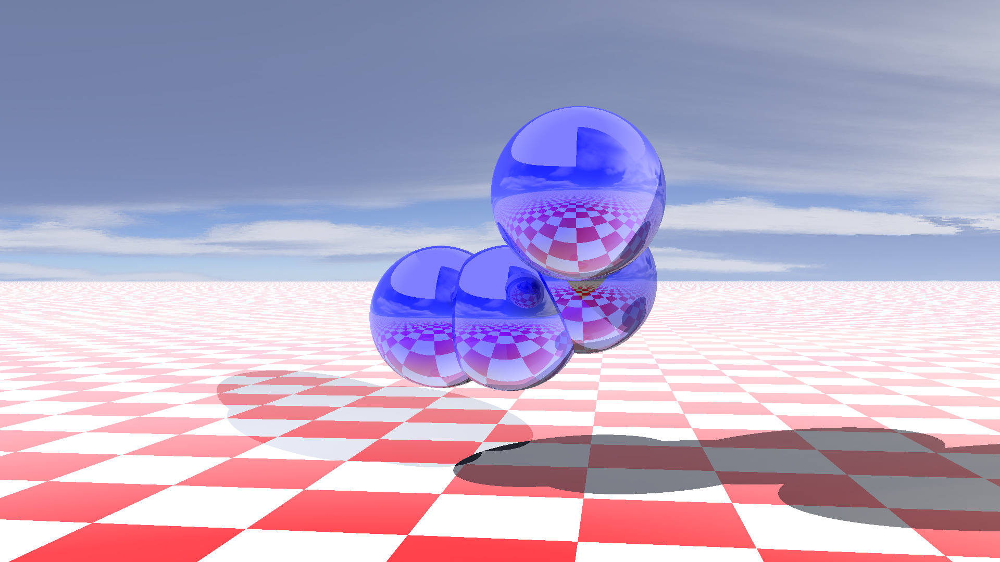

# RayTracer : Lumière, Caméra, Action !

RayTracer est une implémentation puissante et flexible de la technique du ray tracing, largement utilisée pour générer des images numériques à l'allure réaliste en simulant le chemin inverse de la lumière. Le but de notre projet est de concevoir un programme qui génère une image à partir d'une description de scène dans un fichier.

## Utilisation

Pour démarrer le RayTracer, utilisez la commande suivante :

```bash
./raytracer
```

Voici un aperçu de ce que RayTracer peut faire :



## Interaction avec le programme
Notre programme est interactif ! Voici les commandes clavier pour interagir avec le programme :

- Entrée : Recalcule l'image.
- Échap : Quitte la fenêtre.
- Flèches directionnelles : Se déplace d'une scène à une autre.
- Z, Q, S, D, A, E : Modifie la position.
- Ctrl : Passe en mode rotation. Dans ce mode, les touches Z, Q, S, D, A et E changent la direction de la caméra. Lorsque la touche est relâchée, le mode revient à la gestion de la position.

## Conception du programme
Pour ce projet, nous avons adopté une approche modulaire et avons utilisé plusieurs Design Patterns pour rendre le code plus flexible et maintenable :

- Factory : Nous utilisons le pattern Factory pour créer des objets sans spécifier la classe exacte à utiliser. Cela facilite l'ajout de nouvelles classes sans modifier le code existant.
- Singleton : Nous utilisons le pattern Singleton pour nous assurer qu'une classe n'a qu'une seule instance et fournir un point d'accès global à cette instance. Cela garantit que toutes les parties du code utilisent la même instance.
- Observateur : Nous utilisons le pattern Observateur pour permettre à un objet (l'observateur) d'être informé des changements d'état d'un autre objet (le sujet). Cela permet d'éviter un couplage fort entre les classes et facilite la maintenance et l'évolutivité du code.
Configuration des fichiers .cfg

## Configuration des fichiers .cfg

Les fichiers de configuration `.cfg` sont utilisés pour décrire les différents éléments de la scène. Ces fichiers doivent respecter une syntaxe spécifique.

### Syntaxe des fichiers .cfg

- Les fichiers de configuration sont structurés en sections, chacune dédiée à un type d'élément de la scène. Par exemple, la section `camera:` décrit la configuration de la caméra, et la section `primitives:` décrit la configuration des primitives.
- Chaque section est composée de sous-sections qui décrivent chaque élément individuel. Par exemple, sous `primitives:`, il y a des sous-sections pour chaque sphère et chaque plan.
- Chaque sous-section est composée de paires clé-valeur qui décrivent les propriétés de l'élément. Par exemple, la position, la rotation, le matériel, etc.
- Les valeurs peuvent être des nombres, des chaînes de caractères, ou des ensembles de valeurs (pour les vecteurs de position, de rotation, de couleur, etc.).
- Les commentaires peuvent être ajoutés en utilisant le symbole `#`.

Voici un exemple de fichier de configuration pour une scène avec une caméra, plusieurs sphères et un plan :

```cfg
camera:
{
    resolution_width = 1920;
    resolution_height = 1080;
    position_x = 60.0;
    # autres propriétés...
};

primitives:
{
    sphere = (
        {
            name = "Sphere1";
            position_x = 10.0;
            # autres propriétés...
        },
        # autres sphères...
    );

    Plane = (
        {
            name = "Plane1";
            position_x = 0.0;
            # autres propriétés...
        },
    );
};
```
#Ajout de nouvelles primitives
Pour ajouter de nouvelles primitives à la scène, comme des cylindres ou des triangles, il suffit d'ajouter une nouvelle sous-section dans la section `primitives`:. Par exemple, pour ajouter un cylindre :

```cfg
primitives:
{
    Cylinder = (
        {
            name = "Cylinder1";
            position_x = 5.0;
            # autres propriétés...
        },
    );
};
```
Il est important de respecter la syntaxe pour que le programme puisse lire correctement le fichier de configuration et générer la scène correspondante. Si le fichier n'est pas bien formé, le programme pourrait ne pas fonctionner correctement ou générer une scène incorrecte.

## Plugins

Les plugins jouent un rôle crucial dans l'extension des fonctionnalités de notre moteur de rendu. Ce sont des bibliothèques partagées, stockées dans le répertoire `./plugins/`, qui sont chargées lors de l'exécution du programme. Ces plugins nous permettent d'ajouter diverses fonctionnalités à notre moteur, telles que de nouvelles primitives, des lumières, des chargeurs de scène, des interfaces utilisateur graphiques, des moteurs de rendu de base, des effets optiques, etc.

Voici un exemple d'utilisation d'un plugin dans notre code :

```cpp
Raytracer::IEntity *createEntity(const std::map<std::string, std::variant<double, int, std::string, bool>> &setting) {
    // Construction de la scène à partir des paramètres
return new Plugin::Sphere(position, rotation, radius);
}

const char *getName() {
    return SPHERE.c_str();
}

LibType getType() {
    return LibType::ENTITY;
}

void destroyEntity(Raytracer::IEntity *entity) {
    delete entity;
}
```

Pour interagir avec nos plugins, nous définissons des points d'entrée qui permettent de créer et de détruire des entités, des matériaux et des skybox. Ces points d'entrée sont des fonctions exportées par le plugin qui peuvent être appelées par notre programme principal.

Voici un exemple de ces points d'entrée :

```cpp
extern "C"
{
    enum LibType { ENTITY, MATERIAL, SKYBOX };
    
    EXPORT Raytracer::IEntity *createEntity(const std::map<std::string, std::variant<double, int, std::string, bool>> &setting);
    
    EXPORT void destroyEntity(Raytracer::IEntity *entity);
    
    EXPORT Raytracer::IMaterial *createMaterial(const std::map<std::string, std::variant<double, int, std::string, bool>> &setting);
    
    EXPORT void destroyMaterial(Raytracer::IMaterial *material);
    
    EXPORT Raytracer::ISkybox *createSkybox(const std::map<std::string, std::variant<double, int, std::string, bool>> &setting);
    
    EXPORT void destroySkybox(Raytracer::ISkybox *skybox);
    
    EXPORT const char *getName();
    
    EXPORT LibType getType();
}
```

Ces points d'entrée sont définis dans une section extern "C" pour indiquer qu'ils utilisent la convention d'appel C, ce qui permet de les appeler depuis n'importe quel langage qui supporte cette convention. Chaque point d'entrée est une fonction qui effectue une tâche spécifique, comme créer une entité, détruire un matériau, ou récupérer le nom du plugin.

## Auteurs

RayTracer a été créé avec passion par :


- [@RomainPanno](https://github.com/romainpanno)
- [@BriseDesousa](https://github.com/KitetsuK)
- [@AdilNouiri](https://github.com/Nabzilooo)
- [@AlexandreLagasse](https://github.com/alexandrelagasse)

## License

Ce projet est sous license [MIT](./LICENSE).

## Comment construire

Pour construire le projet sur votre machine locale, suivez ces étapes :

```bash
# Cloner le repo
git clone https://github.com/votre-repo/raytracer.git

# Aller dans le dossier du projet
cd raytracer

# Compiler le projet
cmake .
make
```

une fonctionnalité que vous aimeriez voir ajoutée, n'hésitez pas à ouvrir une issue pour en discuter. Si vous souhaitez contribuer, n'hésitez pas à ouvrir une Pull Request.
